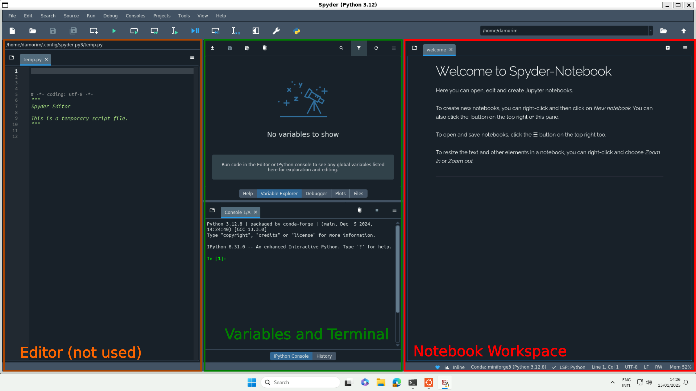
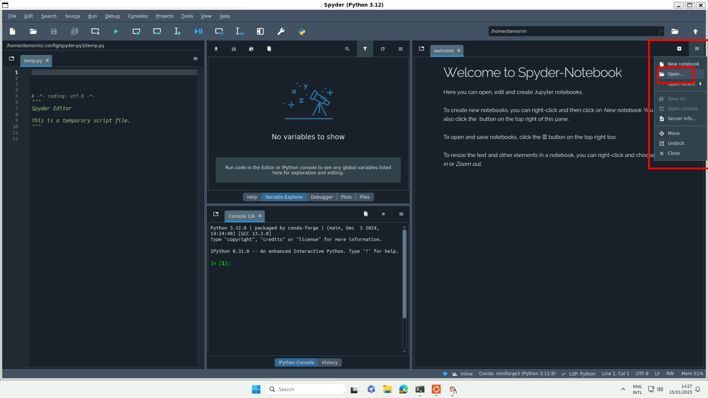
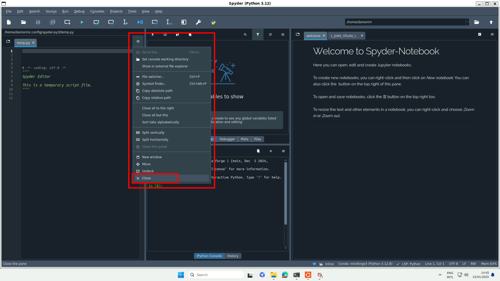
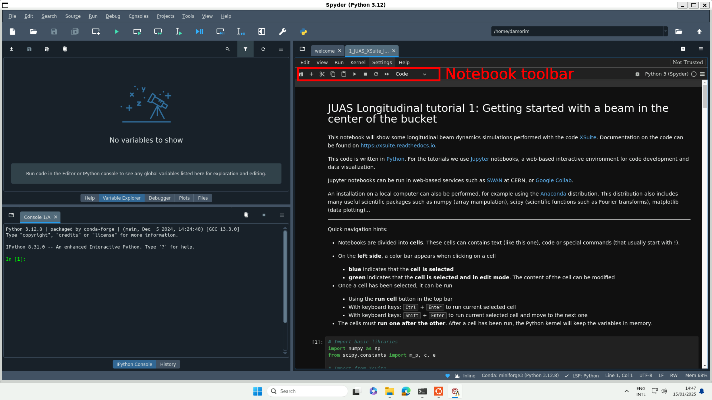

# Installation instructions for the JUAS longitudinal beam dynamics tutorial

The tutorial will use the [Xsuite](https://xsuite.readthedocs.io/en/latest/) package collection.
Xsuite is a tracking code written in Python, that can exploit the CPU and GPU capabilities to track particles in a complex lattice, including non-linear effects, collimation devices, collective effects etc.

A recent version of Python is needed, and for a clean installation we will use [Miniforge](https://github.com/conda-forge/miniforge/), to manage the python and packages installation.

## Summary
- [Installation on Linux](#installation-on-linux)
- [Installation on Windows](#installation-on-windows)
- [Installation on macOS](#installation-on-macos)
- [Remarks and troubleshooting](#remarks-and-troubleshooting)
- [Screenshots of editors](#screenshots-of-editors)

## Installation on Linux

### 1. Install Miniforge
- Open a terminal and download the latest Miniforge for Linux
    - `wget https://github.com/conda-forge/miniforge/releases/latest/download/Miniforge3-Linux-x86_64.sh`
- Make the file executable and run it
    - `chmod +x Miniforge3-Linux-x86_64.sh`
    - `./Miniforge3-Linux-x86_64.sh`
    - Accept the license agreement
    - Change the installation directory if you want, or keep the default
    - At the end of installation, say `yes` to the automatic initialization of the shell with conda
- Close the terminal and reopen it to make the change effective

### 2. Create a dedicated conda environment

Once miniforge has been installed, we create an environment that will contain all the packages we will install.

- Create a conda environment called `py312juas`, that will use Python 3.12, and activate it
  - `conda create -n py312juas python=3.12`
  - `conda activate py312juas`
- Install commonly used packages, jupyter (for interactive notebooks) and xsuite
  - `pip install numpy scipy matplotlib pandas ipython pytest`
  - `pip install jupyter ipympl`
  - `pip install cpymad` to load and manipulate MAD-X lattices (optional)
  - `pip install xsuite xwakes`
  - `pip install xplt[recommended]` to install plotting library for Xsuite

### 3. Test your installation

Download the test notebook from the repository : `https://github.com/amorimd/juas-xsuite-installation/blob/master/test_installation.ipynb`

There are several options available to open, edit and run notebooks:

#### Option 1 : Jupyter notebook

- Open a terminal and launch jupyter
  - `jupyter lab`
- A page should have automatically in your web browser, open the URL that is given in the
  - It looks like this: `http://localhost:8889/lab?token=e9049324df5685f10fd5b7805cd4da36be67d69837119062`
- Open the `test_installation.ipynb` notebook and run it
  - If the installation is OK, all cell should run and no error should appear

#### Option 2 : VSCode
- Download from https://code.visualstudio.com/download
- Install VSCode, run it and add the Python and Jupyter extensions to it
- Open the folder where the notebook `test_installation.ipynb` is located
- Open the notebook, on the top right click "Select Kernel", then "Python Environment" and "py312juas" kernel
- If the installation is OK, all cell should run and no error should appear

## Installation on Windows

This installation will use the Windows Subsystem for Linux (WSL).
Even if you already have installed a python distribution under Windows (for example the Anaconda installer), you still need to follow these instructions as the installation of Xsuite directly under Windows is not possible, a linux kernel is required. 

### 1. Installing WSL, Miniforge and Xsuite
- Open a command prompt or a Power Shell in administrator mode
- Run `wsl --install`
  - This will take some time, ensure you have a good internet connection
- Reboot the system to finalize the installation
- From the application menu, launch the app `Ubuntu` **as administrator**
    - A console will appear, finalizing the installation
    - Provide a Unix username and its associated password
    - The terminal will become the Ubuntu one, you now have a Linux system
- In the Ubuntu terminal, run `sudo apt install ca-certificates wget`. This installs the tools to download files directly from the terminal
- Download the latest Miniforge for Linux
    - `wget https://github.com/conda-forge/miniforge/releases/latest/download/Miniforge3-Linux-x86_64.sh`
- Make the file executable and run it
    - `chmod +x Miniforge3-Linux-x86_64.sh`
    - `./Miniforge3-Linux-x86_64.sh`
    - Accept the license agreement
    - Change the installation directory if you want, or keep the default
    - At the end of installation, say `yes` to the automatic initialization of the shell with conda
- Close the terminal and reopen it to make the change effective
- Install commonly used packages, jupyter and xsuite
  - `pip install numpy scipy matplotlib pandas ipython pytest`
  - `pip install jupyter ipympl`
  - `pip install cpymad` to load and manipulate MAD-X lattices (optional)
  - `pip install xsuite xwakes`
  - `pip install xplt[recommended]` to install plotting library for Xsuite

### 2. Test your installation

Download the test notebook from the repository : ``

Several options are available to open, edit and run notebooks:

### Option 1: Jupyter Lab
- In the Ubuntu terminal, go to the folder where the notebook `test_installation.ipynb` is located
    - Windows folder are available under /mnt (=mounts). The `C:\` drive is under `/mnt/c/`
    - For example the user folder is `cd /mnt/c/<WINDOWS USER NAME>/JUAS/juas-longitudinal-installation`
- Run `jupyter lab` and open in a web browser the link given in the terminal window (you can Ctrl+click it)
- In Jupyter Lab, go to the notebook location, open it and run it.
- If the installation is OK, the notebook should run without errors.

### Option 2: VSCode, and connecting it to the WSL
Instructions are taken from https://learn.microsoft.com/en-us/windows/wsl/tutorials/wsl-vscode
- Download and install VSCode (the Microsoft version, not the Linux one) from https://code.visualstudio.com/download
- During install: "When prompted to Select Additional Tasks during installation, be sure to check the Add to PATH option so you can easily open a folder in WSL using the code command. " (from documentation)
- Once the install is finished, launch VSCode. In the left side panel, go to "Extensions" and install the "Remote Development"
- Open the command palette of VSCode (`Shift+Ctrl+P`) and type `WSL`. Several command appear, select `WSL: Connect to WSL`
- You now have VSCode running with the Linux subsystem. Add the folder where you have the notebooks to the editor (File>Open folder or `Ctrl+K Ctrl+O`). The Windows folder are mounted on the WSL at `/mnt/`. The Windows user directory is at `/mnt/c/<WINDOWS USER NAME>/`
- Install the extensions for VSCode 'Python' and 'Jupyter' (if you open a notebook)
- Open a notebook and on the top right click "Select Kernel" (if you didn't install the extensions, you will be prompted at this moment).
- Select the "Python Environment" and then the "base kernel"
- You can now run the notebook!

### Option 3: Spyder
- In the Ubuntu terminal, run `conda install spyder-notebook`
- Launch `spyder` from the terminal
- Open the notebook with the notebook pane of spyder (by default it should appear on the right hand of the window)
- Run the notebook!

## Installation on macOS

Adapted from Xsuite installation instructions: https://xsuite.readthedocs.io/en/latest/installation.html#install-miniforge

### 1. Installing Miniforge and Xsuite

- Open a terminal
- Download and launch the latest Miniforge installer for the macOS version you have:
    - `curl -OL https://github.com/conda-forge/miniforge/releases/latest/download/Miniforge3-MacOSX-$(uname -m).sh`
    - `bash Miniforge3-MacOSX-$(uname -m).sh`
    - Accept the license agreement
    - Change the installation directory if you want, or keep the default
    - At the end of installation, say `yes` to the automatic initialization of the shell with conda
- Close the terminal and reopen it
- Create a new environment and activate it
    - `conda create -n py312juas python=3.12`
    - `conda activate py312juas`
- Install the compilers
    - `pip install compilers`
    - The terminal might ask for "command line developers tools". Say Yes to their Installation
- Install all useful packages, and Xsuite
  - `pip install numpy scipy matplotlib pandas ipython pytest PyQt5`
  - `pip install jupyter ipympl` to install the notebook server
  - `pip install cpymad` to load and manipulate MAD-X lattices (optional)
  - `pip install xsuite xwakes`
  - `pip install xplt[recommended]` to install plotting library for Xsuite

### 2. Test your installation

Download the test notebook from the repository : `https://github.com/amorimd/juas-xsuite-installation/blob/master/test_installation.ipynb`

Several options are available to open, edit and run notebooks:

#### Option 1 : Jupyter notebook
- Download the test notebook from the repos`https://github.com/amorimd/juas-xsuite-installation/blob/master/test_installation.ipynb`
- Open a terminal and launch jupyter
  - `jupyter lab`
- A page should have open automatically in your web browser
  - If the page did not open, there is a link inside the terminal that looks like this: `http://localhost:8889/lab?token=abcdef123456789etc`
- Open the `test_installation.ipynb` notebook and run it
  - If the installation is OK, all cell should run and no error should appear

#### Option 2 : VSCode
- Download from https://code.visualstudio.com/download
- Install VSCode, run it and add the Python and Jupyter extensions to it
- Open the folder where the notebook `test_installation.ipynb` is located
- Open the notebook, on the top right click "Select Kernel", then "Python Environment" and "py312juas" kernel
- If the installation is OK, all cell should run and no error should appear

## Remarks and troubleshooting

- (Linux, macOS) When you open a new terminal, the default python environment is the default one. You need to reactivate the `py312juas` environment each time: `conda activate py312juas`

- (Windows) To paste content in the Ubuntu terminal, you need to use the right click of the mouse (Ctrl+V does not work).

## Screenshots of editors

Jupyter interface

The default jupyter interface is shown below. The notebook view is on the right hand side of the window. The left hand side is the file browser. On top of the notebook view, there is a toolbar to run the notebook.

Spyder interface

The default spyder interface is shown below. The notebook view is on the right hand side of the window.

To open a notebook, click on the hamburger icon on the right hand side of the window, browse files and select the notebook you want to open.

The editor is not needed, you can close it by clicking on the hamburger menu on the top right of the editor.

The notebook view is now the main view of the Spyder window. The toolbar on top allows to run the notebook.

